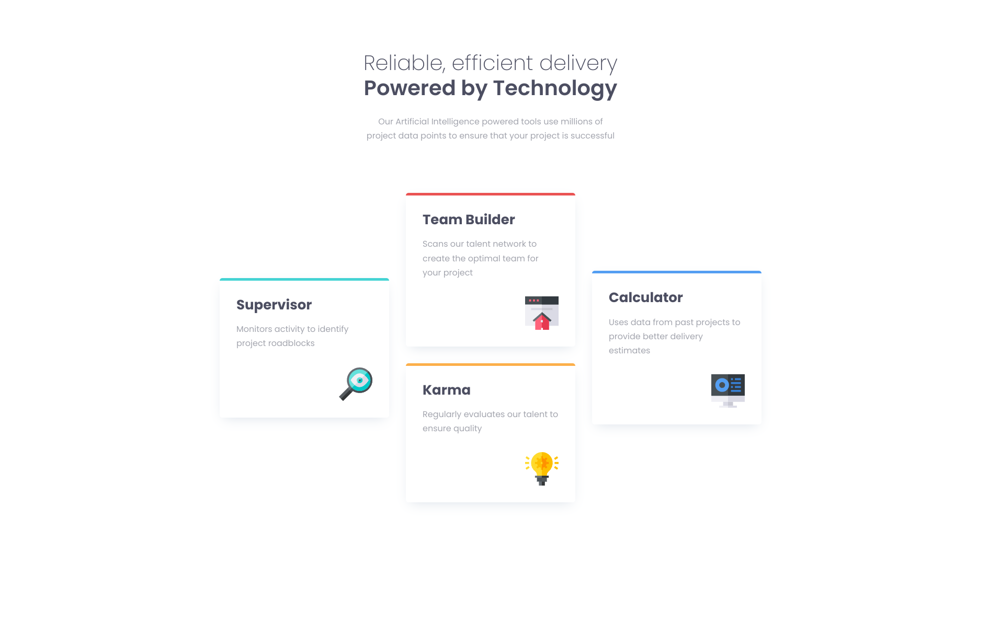

## Table of contents

- [Overview](#overview)
  - [The challenge](#the-challenge)
  - [Screenshot](#screenshot)
  - [Links](#links)
- [My process](#my-process)
  - [Built with](#built-with)
  - [What I learned](#what-i-learned)
  - [Continued development](#continued-development)

## Overview

### The challenge

Users should be able to:

- View the optimal layout for the site depending on their device's screen size

### Screenshot

### Links

- Live Site URL: [Four-card-responsive-design-live](https://four-card-responsive-design.netlify.app)

## My process

### Built with

- Semantic HTML5 markup
- CSS custom properties
- Flexbox
- CSS Grid
- Responsive design

### What I learned

Gained knowledge of how to use media queries for responsive design. For this design, I pre-designed everything before typing any code, to count how much time I need to make such a design as this.

### Continued development

I will learn more about media queries, how they work, and for next challanges i`ll dive deep in to mobile first design, since this one was made using Dekstop first
